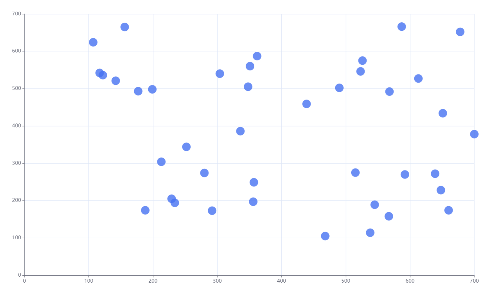
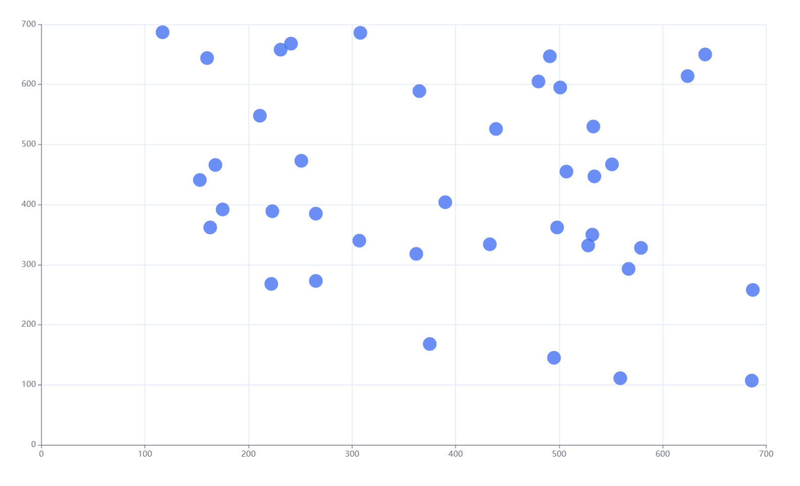
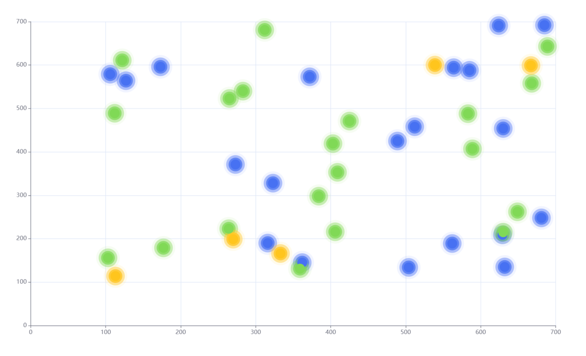
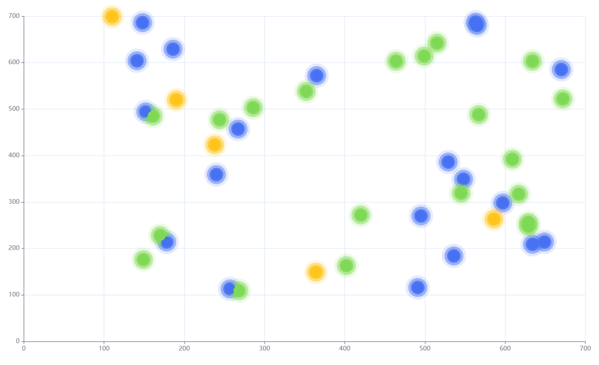
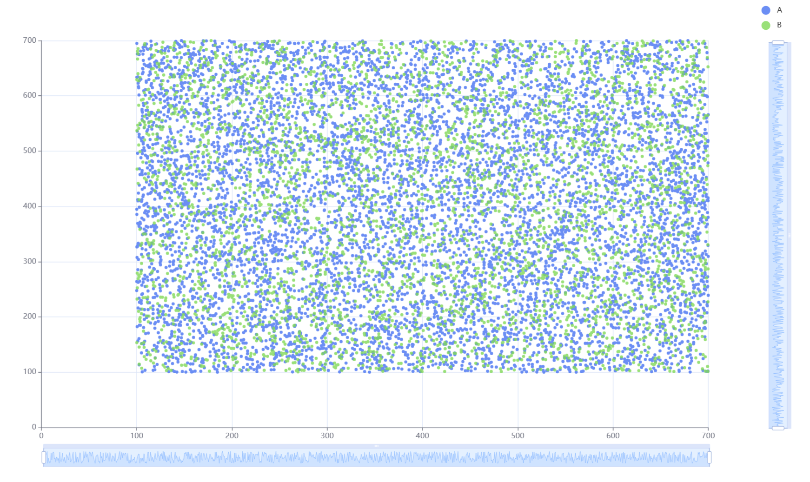
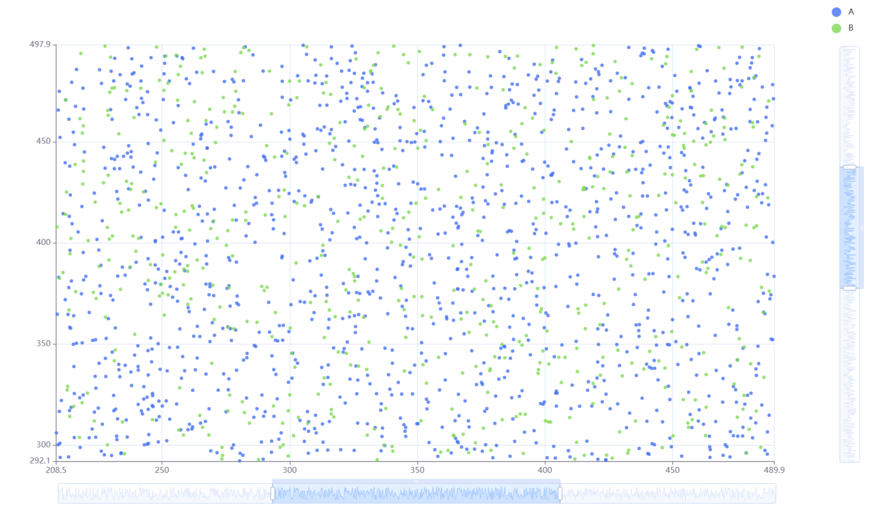
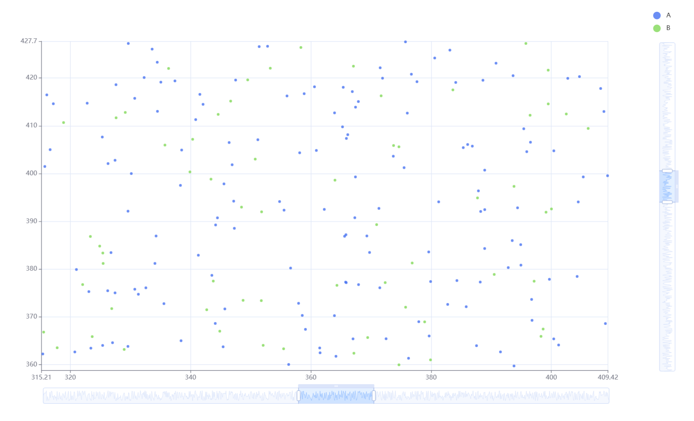
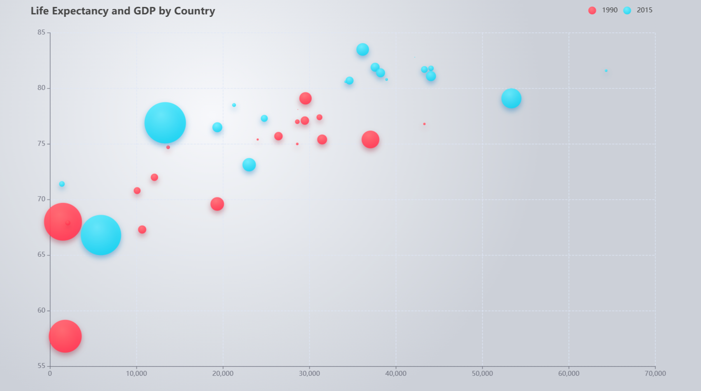

## 散点图与气泡图

### 散点图

```HTML
<html lang="en">
<head>
    <meta charset="UTF-8">
    <title>散点图</title>

    <script src="./js/echarts.js"></script>

</head>

<style>
    #container {
        width: 70vw;
        height: 70vh;
        position: absolute;
        top: 50%;
        left: 50%;
        transform: translate(-50%, -50%);
    }
</style>
<body>
<div id="container"></div>
<script>
    //初始化echarts实例
    var chart = echarts.init(document.getElementById('container'));

    // 指定图表的配置项和数据
    var option =
        {
            xAxis: {},
            yAxis: {},
            series: [
                {
                    data: (function ()
                    {
                        var data = [];
                        for (let i = 0; i < 40; i++)
                        {
                            data.push(
                                [Math.round(Math.random() * 600 + 100), Math.round(Math.random() * 600 + 100)]
                            )
                        }
                        return data;
                    }()),
                    type: 'scatter',
                    symbolSize: 20,
                }
            ]
        };

    //使用刚指定的配置项和数据显示图表
    chart.setOption(option);

</script>

</body>
</html>
```








### 涟漪特效散点图

```HTML
<html lang="en">
<head>
    <meta charset="UTF-8">
    <title>涟漪特效散点图</title>

    <script src="./js/echarts.js"></script>

</head>

<style>
    #container {
        width: 70vw;
        height: 70vh;
        position: absolute;
        top: 50%;
        left: 50%;
        transform: translate(-50%, -50%);
    }
</style>
<body>
<div id="container"></div>
<script>
    //初始化echarts实例
    var chart = echarts.init(document.getElementById('container'));

    // 指定图表的配置项和数据
    var option =
        {
            xAxis: {},
            yAxis: {},
            series: [
                {
                    data: (function ()
                    {
                        var data = [];
                        for (let i = 0; i < 20; i++)
                        {
                            data.push(
                                [Math.round(Math.random() * 600 + 100), Math.round(Math.random() * 600 + 100)]
                            )
                        }
                        return data;
                    }()),
                    type: 'effectScatter',
                    symbolSize: 20,
                },
                {
                    data: (function ()
                    {
                        var data = [];
                        for (let i = 0; i < 20; i++)
                        {
                            data.push(
                                [Math.round(Math.random() * 600 + 100), Math.round(Math.random() * 600 + 100)]
                            )
                        }
                        return data;
                    }()),
                    type: 'effectScatter',
                    symbolSize: 20,
                },
                {
                    data: (function ()
                    {
                        var data = [];
                        for (let i = 0; i < 5; i++)
                        {
                            data.push(
                                [Math.round(Math.random() * 600 + 100), Math.round(Math.random() * 600 + 100)]
                            )
                        }
                        return data;
                    }()),
                    type: 'effectScatter',
                    symbolSize: 20,
                }
            ]
        };

    //使用刚指定的配置项和数据显示图表
    chart.setOption(option);

</script>

</body>
</html>
```








### 大规模散点图

```html
<html lang="en">
<head>
    <meta charset="UTF-8">
    <title>大规模散点图</title>

    <script src="./js/echarts.js"></script>

</head>

<style>
    #container {
        width: 70vw;
        height: 70vh;
        position: absolute;
        top: 50%;
        left: 50%;
        transform: translate(-50%, -50%);
    }
</style>
<body>
<div id="container"></div>
<script>
    //初始化echarts实例
    var chart = echarts.init(document.getElementById('container'));

    // 指定图表的配置项和数据
    var option =
        {
            xAxis: {},
            yAxis: {},
            legend: {
                orient: 'vertical',
                right: 10
            },
            dataZoom: [
                {
                    type: 'slider',
                    xAxisIndex: 0,
                    //filterMode: 'none'
                },
                {
                    type: 'slider',
                    yAxisIndex: 0,
                   //filterMode: 'none'
                },
                {
                    type: 'inside',
                    xAxisIndex: 0,
                    //filterMode: 'none'
                },
                {
                    type: 'inside',
                    yAxisIndex: 0,
                    //filterMode: 'none'
                }
            ],
            series: [
                {
                    data: (function ()
                    {
                        var data = [];
                        for (let i = 0; i < 8000; i++)
                        {
                            data.push(
                                [Math.random() * 600 + 100, Math.random() * 600 + 100]
                            )
                        }
                        return data;
                    }()),
                    type: 'scatter',
                    name: "A",
                    symbolSize: 5,
                    large: true
                },
                {
                    data: (function ()
                    {
                        var data = [];
                        for (let i = 0; i < 4000; i++)
                        {
                            data.push(
                                [Math.random() * 600 + 100, Math.random() * 600 + 100]
                            )
                        }
                        return data;
                    }()),
                    type: 'scatter',
                    name: "B",
                    symbolSize: 5,
                    large: true
                },

            ]
        };

    //使用刚指定的配置项和数据显示图表
    chart.setOption(option);

</script>

</body>
</html>
```











### 气泡图

```html
<html lang="en">
<head>
    <meta charset="UTF-8">
    <title>大规模散点图</title>

    <script src="./js/echarts.js"></script>

</head>

<style>
    #container {
        width: 70vw;
        height: 70vh;
        position: absolute;
        top: 50%;
        left: 50%;
        transform: translate(-50%, -50%);
    }
</style>
<body>
<div id="container"></div>
<script>
    //初始化echarts实例
    var chart = echarts.init(document.getElementById('container'));

    const data = [
        [
            [28604, 77, 17096869, 'Australia', 1990],
            [31163, 77.4, 27662440, 'Canada', 1990],
            [1516, 68, 1154605773, 'China', 1990],
            [13670, 74.7, 10582082, 'Cuba', 1990],
            [28599, 75, 4986705, 'Finland', 1990],
            [29476, 77.1, 56943299, 'France', 1990],
            [31476, 75.4, 78958237, 'Germany', 1990],
            [28666, 78.1, 254830, 'Iceland', 1990],
            [1777, 57.7, 870601776, 'India', 1990],
            [29550, 79.1, 122249285, 'Japan', 1990],
            [2076, 67.9, 20194354, 'North Korea', 1990],
            [12087, 72, 42972254, 'South Korea', 1990],
            [24021, 75.4, 3397534, 'New Zealand', 1990],
            [43296, 76.8, 4240375, 'Norway', 1990],
            [10088, 70.8, 38195258, 'Poland', 1990],
            [19349, 69.6, 147568552, 'Russia', 1990],
            [10670, 67.3, 53994605, 'Turkey', 1990],
            [26424, 75.7, 57110117, 'United Kingdom', 1990],
            [37062, 75.4, 252847810, 'United States', 1990]
        ],
        [
            [44056, 81.8, 23968973, 'Australia', 2015],
            [43294, 81.7, 35939927, 'Canada', 2015],
            [13334, 76.9, 1376048943, 'China', 2015],
            [21291, 78.5, 11389562, 'Cuba', 2015],
            [38923, 80.8, 5503457, 'Finland', 2015],
            [37599, 81.9, 64395345, 'France', 2015],
            [44053, 81.1, 80688545, 'Germany', 2015],
            [42182, 82.8, 329425, 'Iceland', 2015],
            [5903, 66.8, 1311050527, 'India', 2015],
            [36162, 83.5, 126573481, 'Japan', 2015],
            [1390, 71.4, 25155317, 'North Korea', 2015],
            [34644, 80.7, 50293439, 'South Korea', 2015],
            [34186, 80.6, 4528526, 'New Zealand', 2015],
            [64304, 81.6, 5210967, 'Norway', 2015],
            [24787, 77.3, 38611794, 'Poland', 2015],
            [23038, 73.13, 143456918, 'Russia', 2015],
            [19360, 76.5, 78665830, 'Turkey', 2015],
            [38225, 81.4, 64715810, 'United Kingdom', 2015],
            [53354, 79.1, 321773631, 'United States', 2015]
        ]
    ];

    // 指定图表的配置项和数据
    var option =
        {
            backgroundColor: new echarts.graphic.RadialGradient(0.3, 0.3, 0.8, [
                {
                    offset: 0,
                    color: '#f7f8fa'
                },
                {
                    offset: 1,
                    color: '#cdd0d5'
                }
            ]),
            title: {
                text: 'Life Expectancy and GDP by Country',
                left: '5%',
                top: '3%'
            },
            legend: {
                right: '10%',
                top: '3%',
                data: ['1990', '2015']
            },
            grid: {
                left: '8%',
                top: '10%'
            },
            xAxis: {
                splitLine: {
                    lineStyle: {
                        type: 'dashed'
                    }
                }
            },
            yAxis: {
                splitLine: {
                    lineStyle: {
                        type: 'dashed'
                    }
                },
                scale: true
            },
            series: [
                {
                    name: '1990',
                    data: data[0],
                    type: 'scatter',
                    symbolSize: function (data)
                    {
                        return Math.sqrt(data[2]) / 5e2;
                    },
                    emphasis: {
                        focus: 'series',
                        label: {
                            show: true,
                            formatter: function (param)
                            {
                                return param.data[3];
                            },
                            position: 'top'
                        }
                    },
                    itemStyle: {
                        shadowBlur: 10,
                        shadowColor: 'rgba(120, 36, 50, 0.5)',
                        shadowOffsetY: 5,
                        color: new echarts.graphic.RadialGradient(0.4, 0.3, 1, [
                            {
                                offset: 0,
                                color: 'rgb(251, 118, 123)'
                            },
                            {
                                offset: 1,
                                color: 'rgb(204, 46, 72)'
                            }
                        ])
                    }
                },
                {
                    name: '2015',
                    data: data[1],
                    type: 'scatter',
                    symbolSize: function (data)
                    {
                        return Math.sqrt(data[2]) / 5e2;
                    },
                    emphasis: {
                        focus: 'series',
                        label: {
                            show: true,
                            formatter: function (param)
                            {
                                return param.data[3];
                            },
                            position: 'top'
                        }
                    },
                    itemStyle: {
                        shadowBlur: 10,
                        shadowColor: 'rgba(25, 100, 150, 0.5)',
                        shadowOffsetY: 5,
                        color: new echarts.graphic.RadialGradient(0.4, 0.3, 1, [
                            {
                                offset: 0,
                                color: 'rgb(129, 227, 238)'
                            },
                            {
                                offset: 1,
                                color: 'rgb(25, 183, 207)'
                            }
                        ])
                    }
                }
            ]
        };

    //使用刚指定的配置项和数据显示图表
    chart.setOption(option);

</script>

</body>
</html>
```





